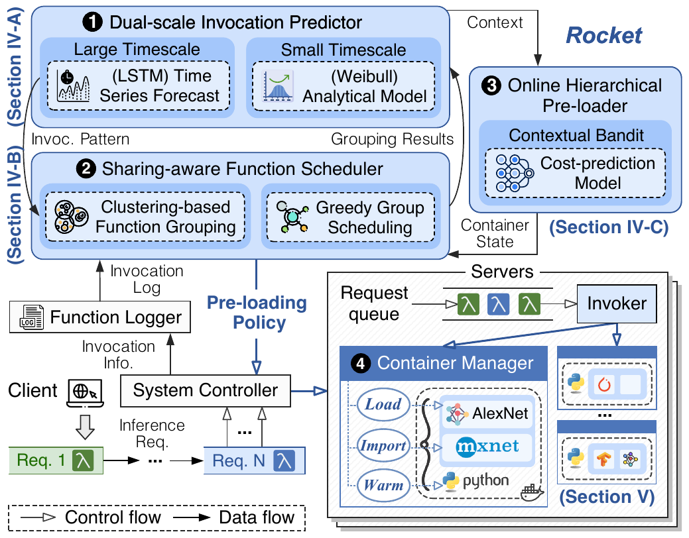

# Rocket: Warming Serverless Inference via Hierarchical ML Artifact Pre-loading and Sharing

<!-- 


 -->

This repository contains the source code for the paper:

> Rocket: Warming Serverless Inference viaHierarchical ML Artifact Pre-loading and Sharing, INFOCOM 2026

## Overview

<p align="center">
  
</p>

Rocket is an OpenWhisk-based serverless ML inference system that reduces startup latency and memory waste through hierarchical ML artifact pre-loading and sharing. This repository is a complete Apache OpenWhisk source tree with Rocket integrated into the scheduler, invoker, container protocol, and experiment scripts.

<!-- --- -->


<!-- - **Dual-scale Invocation Prediction**
  `RocketPredictor` combines a coarse historical-window estimator with a fine-grained Weibull sampler to estimate per-function concurrency under bursty invocation traces.

- **Sharing-aware Function Scheduling**
  `RocketFunctionGrouper` computes the Degree of Sharing from ML artifact similarity and invocation complementarity, then uses agglomerative grouping. `ContainerManager` uses the group decision to bias invoker selection toward co-located compatible functions.

- **Online Hierarchical Pre-loading**
  `RocketBandit` implements a self-contained contextual bandit with K-class state actions. It replaces external VW/sklearn dependencies with online linear cost models so the project builds inside the OpenWhisk tree.

- **Container Manager Protocol**
  The invoker augments action-container `/run` requests with `rocket_phase`, `rocket_state`, `rocket_library`, `rocket_front_model`, and `rocket_back_model`. Rocket-aware runtimes can pre-load ML artifacts before the first real inference invocation. -->

---

## Requirements

### Build Dependencies

- JDK 11 or JDK 17
- Docker 20+
- Gradle wrapper included in this repository
- Python 3.8+ for Rocket helper scripts
- OpenWhisk deployment dependencies: CouchDB, Kafka, ZooKeeper or etcd, depending on the selected OpenWhisk mode

### Python Packages for Experiments

Use a domestic mirror when installing packages:

```bash
python -m pip install -i https://pypi.tuna.tsinghua.edu.cn/simple \
  numpy pandas requests pyyaml tqdm
```

For model workloads, install the ML stack you actually evaluate:

```bash
python -m pip install -i https://pypi.tuna.tsinghua.edu.cn/simple torch torchvision transformers
```

### Gradle / Maven Domestic Mirror

If Maven Central is slow, create or update `~/.gradle/init.gradle`:

```groovy
allprojects {
    repositories {
        maven { url 'https://maven.aliyun.com/repository/public' }
        maven { url 'https://maven.aliyun.com/repository/gradle-plugin' }
        mavenCentral()
        gradlePluginPortal()
    }
}
```

The repository also adds Aliyun and Tencent Maven repositories to `settings.gradle` so Gradle plugins can resolve from domestic mirrors. If the Gradle wrapper distribution itself is slow, download the matching distribution from Tencent Cloud and run it directly:

```bash
curl -L -o gradle-7.6.2-bin.zip https://mirrors.cloud.tencent.com/gradle/gradle-7.6.2-bin.zip
unzip gradle-7.6.2-bin.zip
./gradle-7.6.2/bin/gradle :common:scala:compileScala
```

---

## Build

Compile the modified modules:

```bash
./gradlew :common:scala:compileScala
./gradlew :core:scheduler:compileScala
./gradlew :core:invoker:compileScala
```

Build Docker images:

```bash
./gradlew :core:scheduler:distDocker
./gradlew :core:invoker:distDocker
```

Rocket is disabled by default. Enable it in scheduler and invoker config:

```hocon
whisk {
  rocket {
    enabled = true
    grouping-interval = "1 minute"
    large-window = "1 minute"
    small-window = "10 seconds"
    timestep = "10 seconds"
    max-records-per-function = 4096
    conservative-quantile = 0.8
    sharing-alpha = 0.6
    min-degree-of-sharing = 0.45
    classes = 5
    memory-weight = 0.0024
    epsilon = 0.1
    learning-rate = 0.01
  }
}
```

The default configuration is already present in:

- `core/scheduler/src/main/resources/application.conf`
- `core/invoker/src/main/resources/application.conf`

---

## Deploy

Use the standard OpenWhisk deployment flow for your environment. For local development, start with standalone mode:

```bash
./gradlew :core:standalone:bootRun
```

For a local Rocket smoke test with standalone mode, use the bundled override:

```bash
./gradlew :core:standalone:bootJar
java -jar bin/openwhisk-standalone.jar \
  -c rocket/config/standalone-rocket.conf \
  --dev-mode --disable-color-logging --no-ui --clean
```

For an Ansible deployment, build images first and then deploy the standard components:

```bash
./gradlew distDocker
cd ansible
ansible-playbook -i environments/local setup.yml
ansible-playbook -i environments/local openwhisk.yml
```

Set `whisk.rocket.enabled=true` for both scheduler and invoker before starting the cluster. The implementation is guarded by this flag, so disabling it returns scheduling and container execution to normal OpenWhisk behavior.

---

## Register Rocket Actions

Rocket uses OpenWhisk action annotations to describe shareable ML artifacts and profiling costs. Generate annotations from the example config:

```bash
python rocket/tools/annotate_action.py \
  --config rocket/config/rocket-actions.example.json \
  --action vgg19 \
  --print-json > rocket-vgg19-annotations.json
```

Create a Python action with those annotations:

```bash
wsk action create vgg19 actions/vgg19.py \
  --kind python:3 \
  --memory 1024 \
  --annotation-file rocket-vgg19-annotations.json
```
---

## Python Runtime Helper

Use `rocket/runtime/python/rocket_manager.py` inside Python actions:

```python
from rocket_manager import RocketContainerManager, rocket_main

manager = RocketContainerManager()

def infer(payload, rocket):
    front = rocket.front_model(payload.get("rocket_front_model"), payload)
    back = rocket.back_model(payload.get("rocket_back_model"), payload)
    return {
        "front_loaded": front is not None,
        "back_loaded": back is not None,
        "input": payload.get("input")
    }

main = rocket_main(infer)
```

For real models, pass custom loaders:

```python
def load_front(meta):
    import torch
    return torch.load(meta["path"], map_location="cpu")

def load_back(meta):
    import torch
    return torch.load(meta["path"], map_location="cpu")

manager = RocketContainerManager(front_loader=load_front, back_loader=load_back)
```
---

## Experiments

Replay a CSV trace with columns `timestamp_ms,action,payload`:

```bash
python rocket/tools/replay_trace.py \
  --trace traces/azure_sample.csv \
  --wsk wsk \
  --speedup 10 \
  --blocking
```
---

## Reference

- [Apache OpenWhisk](https://openwhisk.apache.org/)
- [Serverless in the Wild: Characterizing and Optimizing the Serverless Workload at a Large Cloud Provider](https://www.usenix.org/conference/atc20/presentation/shahrad)
- [Pre-warming is Not Enough: Accelerating Serverless Inference with Opportunistic Pre-loading](https://dl.acm.org/doi/10.1145/3698038.3698562)
- [Tetris: Memory-efficient Serverless Inference through Tensor Sharing](https://www.usenix.org/conference/atc22/presentation/li-jinghan)
- [Optimus: Warming Serverless ML Inference via Inter-function Model Transformation](https://dl.acm.org/doi/10.1145/3627703.3650086)
- [RainbowCake: Mitigating Cold-starts in Serverless with Layer-wise Container Caching and Sharing](https://dl.acm.org/doi/10.1145/3620666.3651347)